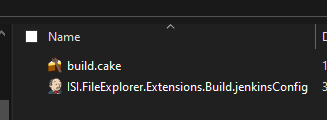
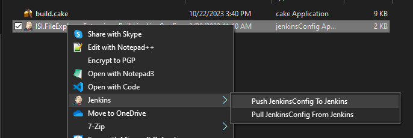
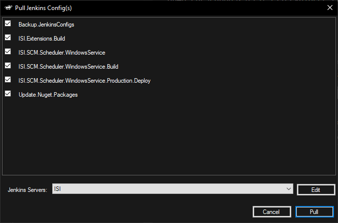
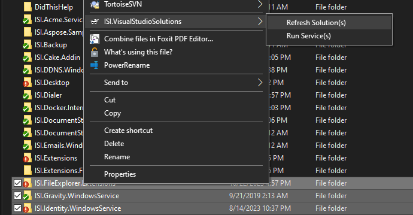
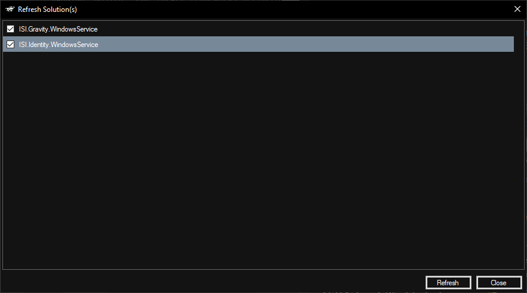
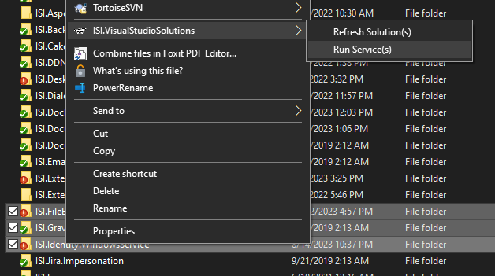

# ISI.FileExplorer.Extensions

Download from https://www.isi-net.com/file-store/download/6cee4d35-449c-409a-8b46-c0c3ed066323/ISI.FileExplorer.Extensions

### File Icons

* For Build Scripts
* For Jenkins Config Files

### Jenkins

* Push To Jenkins

If you right click on a file ending in ".jenkinsConfig" you can push the config(s) to Jenkins:

Then enter your credentials and select the config(s) you want to push to Jenkins

* Pull From Jenkins

If you right click on a folder or a file ending in ".jenkinsConfig" you can pull the config(s) from Jenkins:

Then enter your credentials and select the config(s) you want to update from Jenkins

### Visual Studio Solutions

* Refresh Solutions

If you right click on any folder(s) with a "*.sln" file nested within them (Be careful you can end up opening a large number of solutions)

Pick Solutions and options

* Run Service(s)

If you right click on any folder(s) with a "*.sln" file nested within them (Be careful you can end up opening a large number of solutions)

Pick Solutions and options

### Get AssemblyName BindingRedirect

* Get AssemblyName BindingRedirect

If you right click on any dll

and the BindingRedirect is now in your clipboard

